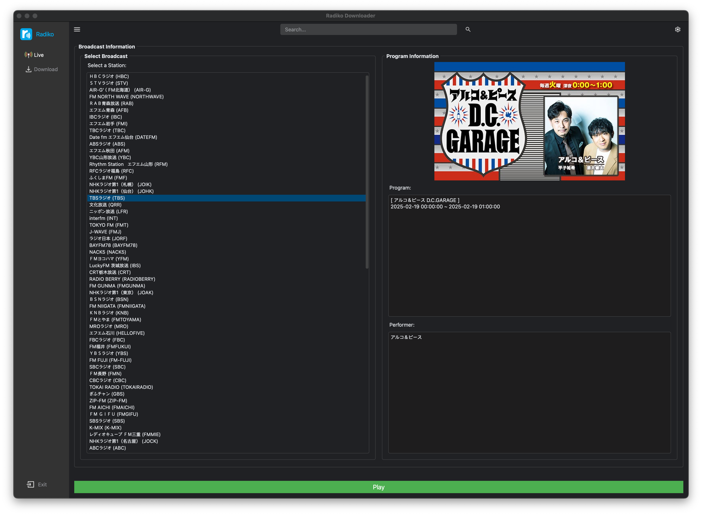
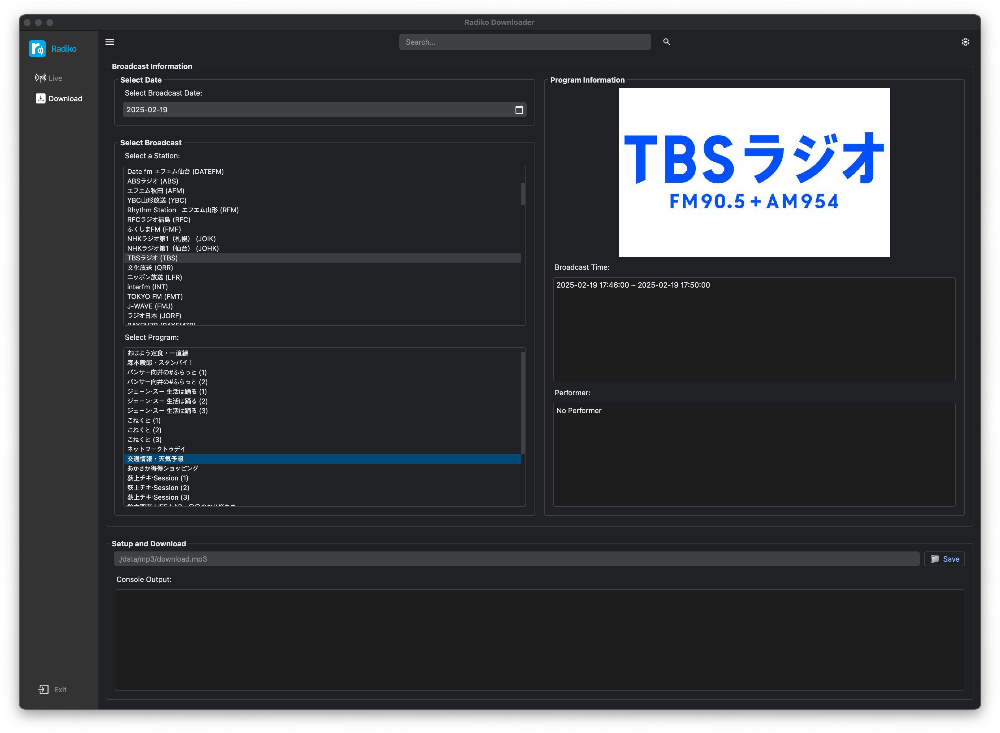

[](https://github.com/devhaaana/radipy/blob/main/LICENSE)
[](#release-files "Release Files")
[](https://github.com/devhaaana/radipy/commits "Commit History")
[](https://github.com/devhaaana/radipy/pulse/monthly "Last Commit")

`radipy` is a desktop application for streaming and downloading broadcasts from [radiko.jp](https://radiko.jp/), a Japanese radio service, outside of Japan, with a PyQt5-based interface.

## Index

<div class="index-container">
  <ul>
    <li><a href="#index">Index</a></li>
    <li><a href="#warning">Warning</a></li>
    <li><a href="#technologies">Technologies</a></li>
    <li><a href="#technical-details">Technical Details</a></li>
    <li><a href="#getting-started">Getting Started</a>
      <ul>
        <li><a href="#installation">Installation</a></li>
        <li><a href="#usage">Usage</a></li>
      </ul>
    </li>
    <li><a href="#release-files">Release Files</a></li>
    <li><a href="#reference">Reference</a></li>
  </ul>
</div>

## Warning

**Please do not use this project for commercial use. Only for your personal, non-commercial use.**

## Technologies

- `Python` : 3.12
- `PyQt`
- `FFmpeg`

## Technical Details

The authentication of PC(html5) version radiko validates user's location via IP address.
However, the android version of radiko validates user provided by GPS information, not via user's IP address.

## Getting Started

### Installation

- You can install it **locally:**
  ```bash
  $ git clone https://github.com/devhaaana/radipy.git
  $ cd radipy
  ```
- Make sure you have **Python** installed on your system. Then, install the **required packages** by running the following command:
  ```bash
  conda create -n radiko_env python=3.12
  conda activate radiko_env
  pip install -r requirements.txt
  ```

### Usage

```bash
python main.py
```




## Release Files

| File                                                                                    | Description                                                        |
| --------------------------------------------------------------------------------------- | ------------------------------------------------------------------ |
| [radipy-1.0.0.zip](https://github.com/devhaaana/radipy/archive/refs/tags/v1.0.0.zip)       | A*ZIP* file containing the full source code of radipy v1.0.0.    |
| [radipy-1.0.0.tar.gz](https://github.com/devhaaana/radipy/archive/refs/tags/v1.0.0.tar.gz) | A*TAR.GZ* file containing the full source code of radipy v1.0.0. |

## Reference

- [rajiko](https://github.com/jackyzy823/rajiko)
- [radiko-downloader](https://github.com/devhaaana/radiko-downloader.git)
