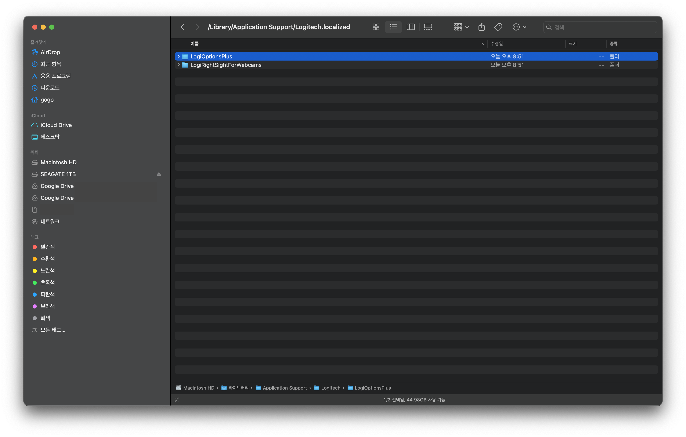

 

## 갑자기 Logi Options+ 무한로딩?

Logi Options+엔 고질병이 있다.

바로 무한 로딩에 빠지는 것.

잘 되다가 업데이트하고 나면 실행이 안 된다거나, 설치가 안 된다거나, 무한 로딩에 빠진다거나 하는 애증의 Logi Options+이다.

대다수의 사람이 Flow와 제스처 같은 기능 때문에 참고 사용할 것이다.

무려 3달 전 업데이트 이후에 갑자기 실행이 안 되길래 재설치를 했지만, 무한 로딩에 빠졌다.
(덕분에 저혈압을 치료했다. 병원비도 아끼고 좋은게 좋은거지 껄껄.)

화가 난 나머지 삭제를 하고 제스처 등등의 기능 없이 사용을 했지만, 습관은 무서운 법.

결국 다시 재설치를 하기로 했다.

App Cleaner로 지우고 설치해도 무한 로딩에 빠졌고, 구글에서 해결 방법을 열심히 찾아봤다.

### 해결 방법

해결 방법은 아래와 같다.

- App Cleaner로 Logi Options+와 관련된 모든 것을 제거한다.

- Library > Application Support > Logitech 에서 Logi Options+ 폴더를 제거한다.

- Logi Options+을 재설치한다.
